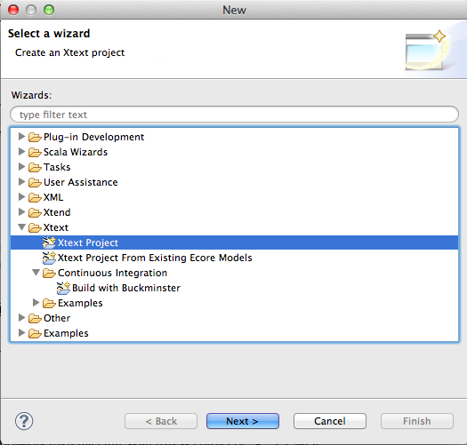
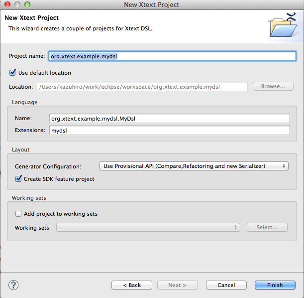

# Xtextについて

XtextはJavaによるDSLの開発を容易にするようにしたEclipseベースのフレームワーク

## 歴史
* 2006年openArchitectureWare(oAW) projectによって開発
* 2008年にeclipse Modeling Project傘下
* itemisによって開発されている。

## 機能

* DSLを作る際に、Xtext言語を使って文法を記載する。
* テキスト形式の定義からEcoreモデルが派生される。
* 上記定義からコードジェネレータがANTLR parser、オブジェクトモデルが作成

IDEとして以下のような機能が作成される。

* エディタのシンタックスハイライト
* コード補完
* コードヒント
* アウトラインビュー
* ソースコードナビゲーション
* 比較ビュー
* ホバー
* コードの折りたたみやリファクタリング

## 作成方法
* xtextプロジェクトの作成

* 拡張子をqdslに設定

* xtextを修正する。

* GenerateQDsl.mwe2を右クリックでMWE2 Workflowを実行する。

### validationを追加

* QDslJavaValidation.javaに@Checkのannotationのついたメソッドを作成するとvalidationになる。

        @Check
        public void checkAnswerTypeCorrespondence(Question question) {
            if ( XXXX ) {
                error("",XXXX);//これでエラーとなる。
            }
        }

### ソースコード生成用JavaまたはWorkflowを作成するように設定

* GenerateQDsl.mwe2

                fragment = generator.GeneratorFragment {
                    generateMwe = true //ソースコード生成MWE作成
                    generateJavaMain = true //ソースコード生成用
                }
